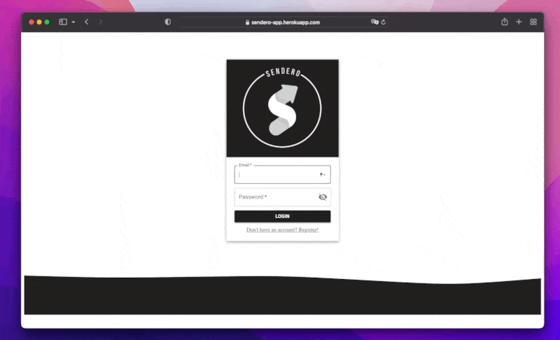
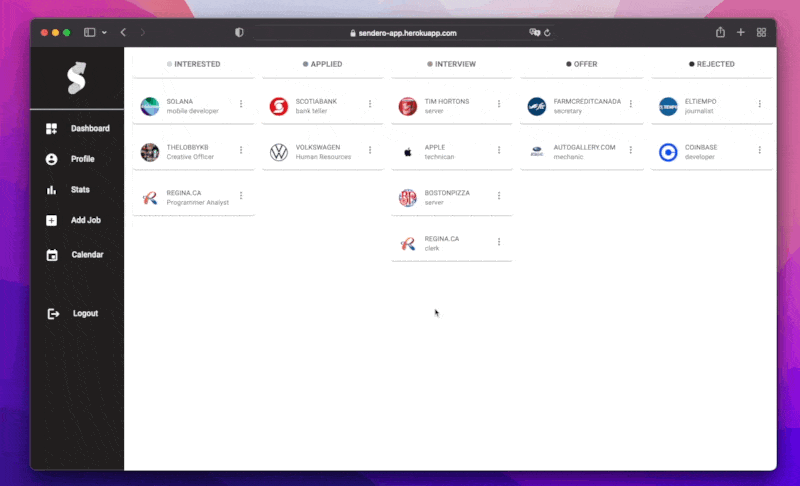
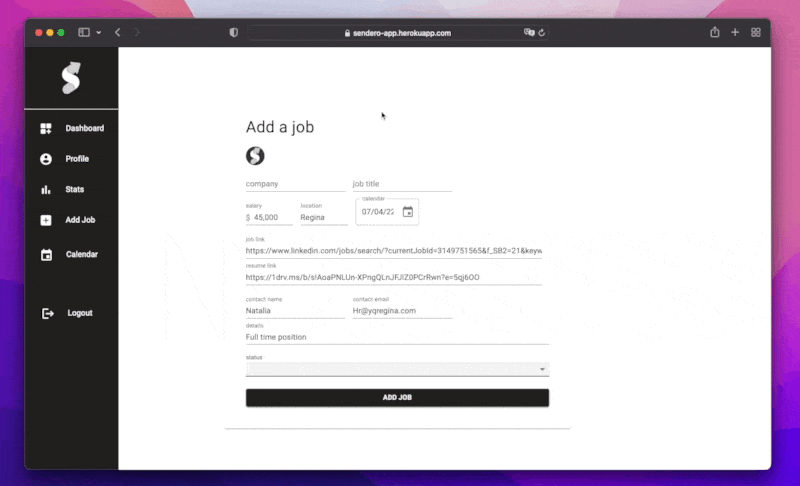

# Sendero Job Tracker App
Sendero is a full stack application that keeps track of every detail while on your job search. Keep your job search organized and all in one place!

**Link to project:** https://sendero-job.herokuapp.com/

## How It's Made:

**Tech used:** React, Material UI ,Redux Toolkit, Express, MongoDB, NodeJS

The beginning of this project started with a logo design that I created using Adobe Illustrator and Photoshop. Im a visual person so I like to work around a certain concept before jumping into the code. Once I had the planning and wireframes completed I began on the backend of the application using Insomnia to test my routes to a MongoDB database. After the backend setup I started working on the frontend where I had to learn Material UI with every component I built. I also wanted to challange my ability to learn something new which is why I decided on utilizing Redux Toolkit as my state managment.

## Optimizations

There a quite a few optimizations that I would like to add in order to improve the overall user experience. 
  - Connecting users google calendar to make it easier to add important job dates.
  - Adding a drag and drop feature to the dashboard UI so a user doesnt have to enter the edit form in order to change the status of his added job
  - The ability to change password if user desires from profile page
  - Having a chrome extension to quickly add jobs from website like Linkedin/indeed

## Dependencies
### Client:
- Date-fns
- Material UI
- Axios
- React - Redux

### Server:
- Bcrypt
- Colors
- Dotenv
- Express
- JSON Web Token
- Mongoose
- Morgan

## Getting Started
Install dependencies using the npm install command within each client/server folders.

- Start the client web server using the npm start local command within the client folder. The app will be served at http://localhost:3000/.

- Start the server using the npm start local command within the server folder Go to http://localhost:8000/ in your browser.

